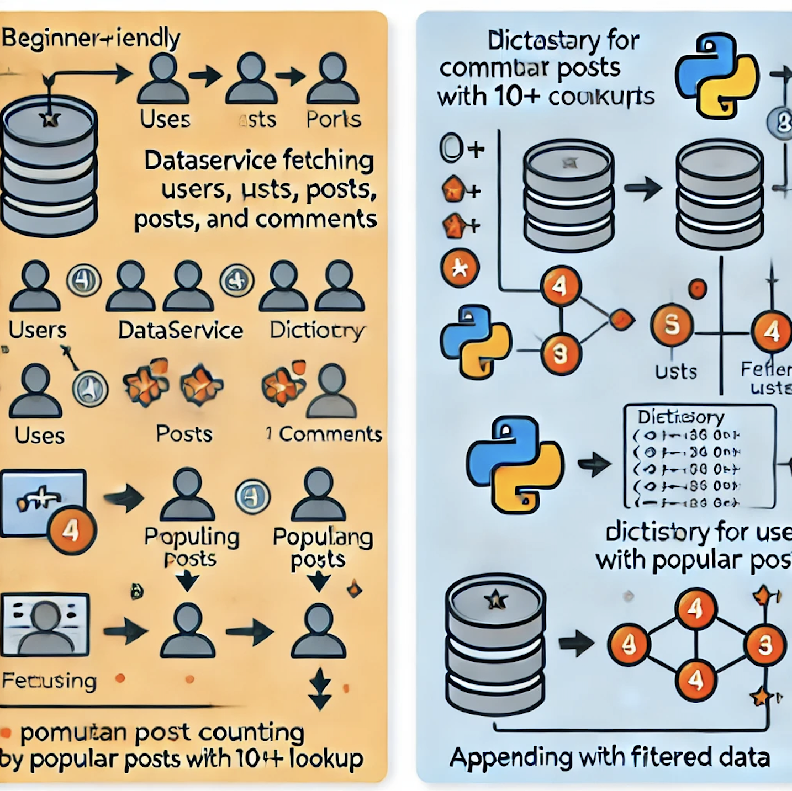

# About

The goal of this repo is to test the developer's basic knowledge of Python, problem solving and testing.

Open ./user_service.py and implement the get_users_with_popular_posts function such that:

-   it returns users from the provided DataService as an array
-   ensure that each user has a "posts" field that contains all posts by that user
-   the list of users should only include those who have written a "popular" post (any single post with 10 or more comments)

## Stretch goal

Implement unit tests for the get_users_with_popular_posts method.





# About
The purpose of this repository is to evaluate the developer's understanding of Python, problem-solving skills, and unit testing. The implementation focuses on identifying users with "popular" posts and optimizing the solution for performance.

## Task Description
Open `user_service.py` and implement the `get_users_with_popular_posts` function. The function must:

- Return users fetched from the provided `DataService` as an array.
- Include a `posts` field for each user, containing all posts by that user.
- Only return users who have written a "popular" post — defined as any single post with 10 or more comments.

---

## Implementation Goals

### Core Requirements:
1. Identify users who meet the "popular post" criteria.
2. Append each user's posts to their respective user object.
3. Ensure efficient and readable code.

### Stretch Goals:
- **Unit Testing**: Add unit tests for the `get_users_with_popular_posts` function to verify correctness and edge cases.

---

## Performance Metrics
The following performance metrics were recorded for various implementations:

| Implementation Type    | Users Identified | Elapsed Time (Seconds) |
|-------------------------|------------------|-------------------------|
| **Standard**            | 4               | 0.001409               |
| **Adrian Optimized**    | 4               | 0.000167               |
| **AI Optimized**        | 4               | 0.000142               |

### Sample Output:


---

## Files in This Repository

### Main Files:
1. **`user_service.py`**: Contains the core function to implement (`get_users_with_popular_posts`).
2. **`data_service.py`**: Provides the `DataService` class to retrieve users, posts, and comments.

### Supporting Files:
- **`app.py`**: Demonstrates the execution of the function with sample inputs and benchmarks its performance.
- **`README.md`**: This documentation file.

---

## How to Run the Project

1. Clone the repository:
   ```bash
   git clone https://github.com/drumadrian/tech-test-python
   cd tech-test-python


## About
###The purpose of this repository is to evaluate the developer's understanding of Python, problem-solving skills, and unit testing. The implementation focuses on identifying users with "popular" posts and optimizing the solution for performance.

## Task Description
Open user_service.py and implement the get_users_with_popular_posts function. The function must:

Return users fetched from the provided DataService as an array.
Include a posts field for each user, containing all posts by that user.
Only return users who have written a "popular" post — defined as any single post with 10 or more comments.


## Sample Output

```sql
There are 4 users with popular posts
elapsed_seconds:  0.001409

There are 4 users with popular posts (Adrian Optimized)
elapsed_seconds(optimized):  0.000167

There are 4 users with popular posts (AI Optimized)
elapsed_seconds(ai_optimized):  0.000142


####################################################################################
elapsed_seconds:  0.001409
elapsed_seconds(ai_optimized):  0.000167
elapsed_seconds(ai_optimized):  0.000142
####################################################################################


BONUS Test Results: 


